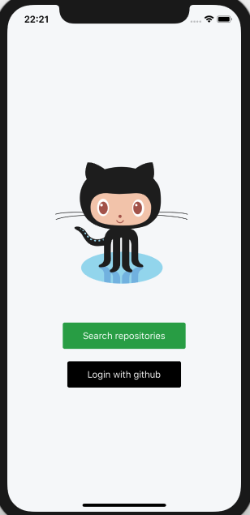
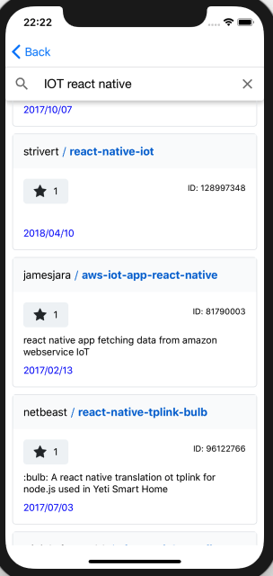

# Github repository finder

Simply search github projects, view top rated projects easily. This app is written in
react-native 0.60, you can use default scripts for building the app or:

## Build android
`npm run apk` will generate a signed APK.

## IOS
follow the normal process.

This app has been tested for Android and IOS.

## Notes:
- App uses mobx for state management.
- For search, it uses react native paper components
- Logo has been made by Ali Torabi using aftereffects and added to project using lottie animations
- Code is using prettier default settings

